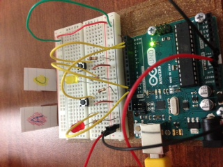
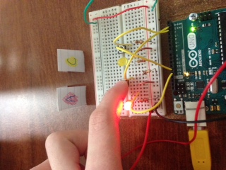
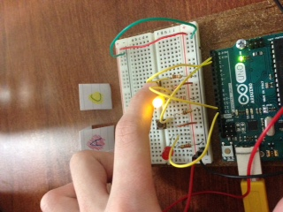

QUICK NOTE: A pitch reference device

Sometimes musicians need a quick reference to a pitch. Sometimes this is achieved via a piano, or with singers- a harmonica-like device. A is a common tuning note for musicians to use as pitch reference. Sometimes having a C handy is useful too, when singing in the fixed do solfege system. The button attached to the yellow LED represents the C pitch, and the button attached the red represents A. When the user presses each button, the corresponding note sounds via a small speaker that is hooked up to the Arduino. The pitch quality is very minimal, and so should only be used as a quick reference as opposed to a true tuning device. Obviously more code would be necessary to program the speakers-arduino-pitch relationships, but the two button layout is a good start. 

